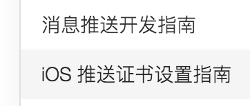

# 文档平台改进

## 内容

### 移除
- 顶部导航菜单
- 文档阅读指南（X）
- 快速入门（rename 安装和初始化）
- 功能概览（merge 各功能指南）
- 常见问题（merge 各功能指南）
- 常见功能提示（merge 各功能指南）
- iOS 推送证书设置指南（merge 消息推送开发指南）
- 崩溃报告使用指南（merge 安装和初始化）
- CQL 查询语言详解
- LeanCloud 开放平台接入
- 应用之间数据共享（merge 控制台指南）
- 离线数据分析使用指南（merge 控制台指南）
- 用户群分析（merge 控制台指南）
- 第三方平台账号登录开发指南（rename oauth 指南）


- 订阅更新
- 手工定位锚点，不一定是标题，中英文均可：`<a id="customize_notification_for_offline_message" data-author="2015-11-15@myleslee@Da Li">`，不要用 name 属性，`<a name="xxxx">`， HTML5 已经不支持。
- 概览合并入模板

## 结构重构

- 回到顶部
  - 固定到底部
  - 平滑移动
- 书签/链接
  - 返回原来章节
  - 定制 anchor 来定位每个段落
  - 引用时不要加语言（iOS 文章内：详情请点击：iOS / OS X 关系建模指南》关系建模指南）
- 最后更新日期（放顶部）
- 文档链接 permanent link
- 锚点跳转要平滑，让人知道移动的方向
- iOS：推送和推送证书合并
  
- API 加入返回 docs 的导航
- 更新搜索返回结果的域名（现在是 cn.avoscloud.com）
- 格式自动化：
  - 路径：`[控制台|//选择应用|存储|云引擎|LeanCache]`
  `[控制台/<span class="text-muted">（选择应用）</span>/ **存储** / **云引擎** / **LeanCache**`
  - 将菜单路径中的大于号（Level1 > Level 2）替换成 CSS
  - 代码块
    - 行号
    - 不折行
    - 美化缩进
  - 

### 快速入门

- 没有主标题，导航也不高亮
- Step 3 的内容只能从 H4 开始（H3 有下横线）
- 如果不登录，「选择应用」不出现（鼓励用户登录）
- 不登录状态下 {{AppId}} 要显示为 `<APP_ID>`
- global 选择应用的作用：
  - 联动：入门引导（选择应用）、代码块（选择应用）
  - 生成 blank project

## 样式

- 自定义下划线（`<u>`）：<http://36kr.com/p/210772.html>  
  1. **加粗标题一**  
    这是一个正常的段落，**但有些文字也要加粗，看起来关注层次比较乱**。
  2. **加粗标题二**  
    如果用下划线来取代加粗，效果就会好很多。<span style="border-bottom:1px solid #333; padding-bottom:2px">斜体仅对西文有效，中文没有斜体，但下划线是通用的</span>。另外传统的 underline 样式过于接近字体的底部，所以推荐用 border。
 
- 加粗中的代码不要加粗：**加粗的中文与加粗的代码 `thisFunction()`**。 
- image
  - bordered：图片外边框，用于没有边界的屏幕拷贝，如控制台内容。
  - align：center, borderless & bordered
  - resolution: @2x
- 代码块：底色（乱）、行号、指定行加亮
  - `a>code, h1~h6>a {background-color:inherit; alpha 为 0}`，要不让人看不清楚：[云引擎 Hook `_receiversOffline`](#_receiversOffline) 
  - 使用 alpha，对于已经有背景色的 tag，如 `td>a`
- 备注：.text-muted
- links：
  - External links icon
  - External or Internal Reference: floating right 


```
$ avoscloud add <APP-NAME> <APP-ID>
```

```
2015-10-12T02:04:50.179Z    dreday  将逻辑放到前端： 1 如果android，ios，web都有的话，一个逻辑做三份，严重加大了前端程序员负担 2 三个接口无法统一 3 后期逻辑更改必须重新上线
```

## Elegant underline

<http://featurejs.com/>

```
article a {
  text-shadow: 0.05556em 0 0 #fff, 0.11111em 0 0 #fff, 0.16667em 0 0 #fff, -0.05556em 0 0 #fff, -0.11111em 0 0 #fff, -0.16667em 0 0 #fff;
  background-image: -webkit-linear-gradient(#ff6443, #ff6443);
  background-image: -moz-linear-gradient(#ff6443, #ff6443);
  background-image: -ms-linear-gradient(#ff6443, #ff6443);
  background-image: linear-gradient(#ff6443, #ff6443);
  background-position: 0 1.11111em;
  background-size: 1px 1px;
  background-repeat: repeat-x;
  color: #ff6443
}

article a:hover {
  background-image: none
}

a {
    -webkit-tap-highlight-color: transparent;
    text-decoration: none;
}

.alert-warning {
    background-color: #fcf8e3;
    border-color: #faebcc;
    color: #8a6d3b;
}

.alert {
    padding: 15px;
    margin-bottom: 20px;
    border: 1px solid transparent;
    border-radius: 4px;
}

```

<div class="alert alert-warning">
                    <strong>Browser support</strong>
                    <p>This is currently only supported on limited browsers. See <a href="http://caniuse.com/css-resize" target="_blank">Can you run it: Resize</a> for all supported browsers</p>
                  </div>

## 控制台

- 在导航加入 docs 

## 2 Do

- 2015-11-16 11:44 AM——realtime_rest_api.md：了解更详细的签名规则请参考 [聊天签名方法](realtime_v2.html#开启对话签名) <br/>
  与 realtime_v2.html#用户登录的签名 的内容不一致。


